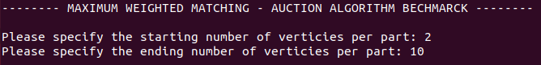
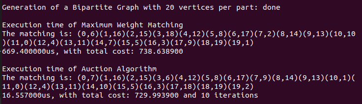
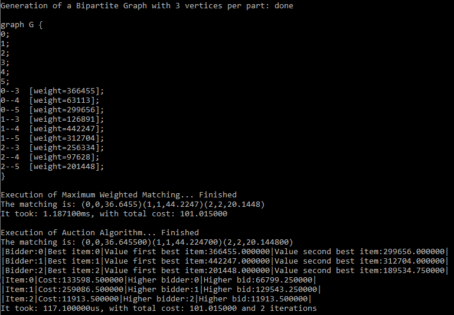

# Maximum Weighted Matching & Auction Algorithm Comparison 
Project based on the comparison of sn implementation of [Auction Algorithm](https://web.mit.edu/dimitrib/www/Auction_Trans.pdf) and the [Maximum Weighted Maching](https://www.boost.org/doc/libs/1_79_0/libs/graph/doc/maximum_weighted_matching.html) from Boost Library

## Startup
In order to run the benchmark you have to run these command in your console:
```
sudo apt update
sudo apt install build-essential
sudo apt-get install libboost-all-dev
```

After that, to compile the project, you have to jump into the */src* folder and type the following line in your console:

```
g++ -std=c++2a -o ../bin/app BipartiteGraph.cpp MaximumWeightedMatching.cpp Auction.cpp Main.cpp
```

For compier optimization instead type:
```
g++ -std=c++2a -Ofast -o ../bin/app BipartiteGraph.cpp MaximumWeightedMatching.cpp Auction.cpp Main.cpp
```

The *.exe* file will be inserted into the */bin* directory.

## Usage
Start the application by typing ```./app```. Next you have to specify if you want to active the VERBOSE mode that permit to view all the used variables from the Auction Algorithm and the starting and ending number of verticies per part of the bipartite graphs.



After have inserted the three options, at each random bipartite graph the application pass it to both algorithms:
* **Maximum Weighted Matching**
* **Auction Algorithm**

And at the end of each algorithm the application will show the actual matching in the following form: **(FROM vertex, TO vertex, WEIGHT)**. In addition in both algorithm we will get the total cost of the matching and only for the Auction Algorithm we will have also the number of iteration for the specific Assignment Porblem.

* VERBOSE mode **OFF**
 
* VERBOSE mode **ON**
 

When the benchmark is finished the application generate a *.csv* file stored into the */data* directory. This file is generated in order to have a look on the complete score of all of three algorithm.